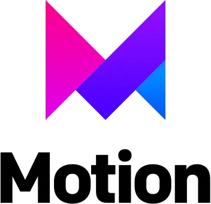

#  🌟 Personal Portfolio - Mia Dinh

This repository contains the source code for my portfolio website, showcasing my skills and projects as a web developer.

The website is deployed and accessible at https://miadinh.netlify.app.

## Tech Stack & Libraries:

  
  
  
  

- **Sanity CMS**: Used for managing and delivering dynamic content through a customizable backend interface.
- **React JS**: Used for building the user interface and managing state.
- **SASS**: Advanced CSS to implement responsive design and ensure optimal display and functionality across various devices.
- **React Tooltip**: Provide contextual hints and information through tooltips in Skills & Experiences section.
- **Framer Motion**: Create smooth and complex animations and transitions. 

---
Feel free to reach out for any questions or feedback. Happy coding! 🚀

